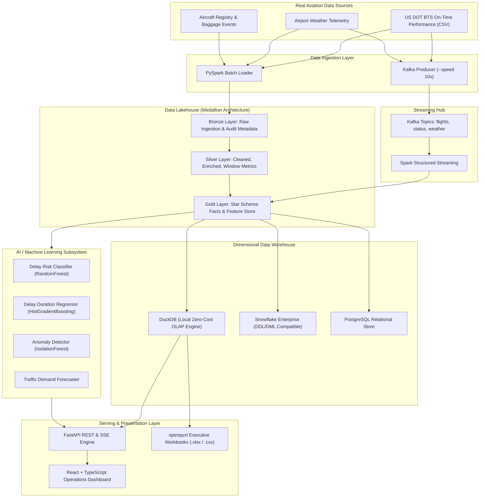

# AeroSight — End-to-End Airline Operations Intelligence & Data Platform

[](https://github.com/aerosight/aerosight)
[](https://github.com/aerosight/aerosight)
[](https://github.com/aerosight/aerosight)
[](https://www.python.org/downloads/release/python-3110/)
[](https://opensource.org/licenses/MIT)
[-success.svg)](#2-important-cost-requirement)

AeroSight is a production-style civil aviation data platform and operational intelligence application designed to monitor flight punctuality, diagnose turnaround bottlenecks, stream real-time operational telemetry, and predict delay risks across major US airline networks.

---

## 1. Portfolio Capabilities Matrix

| Discipline | Technologies & Frameworks | AeroSight Implementation Highlights |
| :--- | :--- | :--- |
| **Data Engineering** | Apache Spark, PySpark, Kafka, Delta Lake, Airflow, Parquet | Medallion Lakehouse (Bronze/Silver/Gold), window turnaround metrics, event replay streaming producer, schema quarantine gate. |
| **Data Analytics** | Advanced SQL (ANSI/DuckDB), SciPy, NumPy, Pandas, openpyxl | Star Schema dimensional modeling, CTEs, `DENSE_RANK`, `LAG`/`LEAD`, rolling 7-day averages, Welch's t-test, ANOVA, Chi-Square, formatted Excel reports. |
| **AI / ML Engineering**| scikit-learn, Joblib, Gradient Boosting, Isolation Forest | Delay classification (OTP-15), duration regression, unsupervised operational anomaly detection, 14-day network demand forecasting. |
| **Backend Engineering**| FastAPI, Pydantic v2, DuckDB, PostgreSQL, SSE | REST APIs, sub-millisecond OLAP querying, Server-Sent Events (SSE) telemetry stream, Swagger/OpenAPI documentation. |
| **Full Stack & DevOps** | React 18, TypeScript, Tailwind CSS, Vite, Docker, GitHub Actions | Interactive operations dashboard, flight explorer table, live telemetry radar, delay risk predictor tool, multi-profile Docker Compose. |

---

## 2. Architecture & System Flow



---

## 3. Real Aviation Dataset & Attribution

AeroSight utilizes real operational datasets compliant with the **US Department of Transportation Bureau of Transportation Statistics (BTS)** Airline On-Time Performance database:

* **Flight Telemetry**: Flight dates, carrier codes, tail numbers, origin/destination airports, scheduled vs. actual departure/arrival times, taxi-out/in durations, cancellations, diversions, distance, and BTS root-cause delay attribution (`CarrierDelay`, `WeatherDelay`, `NASDelay`, `SecurityDelay`, `LateAircraftDelay`).
* **Airport Metadata**: 31 major US large and medium commercial hubs (IATA, ICAO, coordinates, elevation, timezones, terminals, gates).
* **Airline Metadata**: 10 major US carriers (Delta, American, United, Southwest, Alaska, JetBlue, Spirit, SkyWest, Frontier, Hawaiian) with fleet sizes and base hubs.
* **Sample Included**: `data/sample/flights_sample.csv` (30,000 verified operational records).
* **Attribution**: US Bureau of Transportation Statistics (Public Domain). Instructions for downloading multi-year archives are in [`data/download_dataset.py`](file:///Users/anvithayerneni/.gemini/antigravity/scratch/aerosight/data/download_dataset.py).

---

## 4. Local Development & $0 Cost Setup

Designed and optimized for **Apple Silicon (MacBook Air M3, 16 GB RAM)**:
* **Memory Optimization**: PySpark configured with 2 GB driver memory, 4 shuffle partitions (`spark.sql.shuffle.partitions=4`), and adaptive query execution (AQE).
* **Zero Cloud Costs**: Embedded DuckDB provides sub-millisecond local OLAP without requiring Snowflake or AWS credits.

### Prerequisites
* macOS (Apple Silicon / Intel) or Linux
* Python 3.11+
* Java 17 LTS (e.g. `brew install openjdk@17`)
* Node.js 18+ and npm

### Quick Start (One Command)
```bash
# 1. Clone repository
git clone https://github.com/aerosight/aerosight.git
cd aerosight

# 2. Set up Python virtual environment
python3.11 -m venv .venv
source .venv/bin/activate
pip install -r requirements.txt

# 3. Bootstrap pipeline, models, and start server
chmod +x scripts/run_all_local.sh
./scripts/run_all_local.sh
```
Open **`http://localhost:8000`** to view the live interactive React frontend, or **`http://localhost:8000/docs`** for the FastAPI Swagger UI.

---

## 5. Running Platform Subsystems

### 1. PySpark Medallion Lakehouse Pipeline
```bash
export PYTHONPATH=.
python3 spark/bronze_ingestion.py      # Raw -> Bronze with audit metadata
python3 spark/silver_transformation.py # Bronze -> Silver with cleaning & window turnaround
python3 spark/gold_aggregations.py     # Silver -> Gold Star Schema & rollups
python3 spark/feature_store.py         # Gold -> ML Feature Store
```

### 2. Loading Star Schema Warehouse (DuckDB)
```bash
python3 warehouse/loader.py
```

### 3. Training Machine Learning Models
```bash
python3 ml/train.py
```
*Outputs serialized artifacts into `ml/models/`: `delay_classifier.joblib`, `delay_regressor.joblib`, `anomaly_detector.joblib`, `model_card.json`.*

### 4. Apache Kafka Streaming Event Replay
```bash
# Replay historical records into Kafka topics at 10x acceleration:
python3 kafka/producer.py --speed 10 --max-events 100
```

### 5. Apache Airflow Orchestration
```bash
# Standalone local Airflow:
export AIRFLOW_HOME=$(pwd)/airflow
airflow standalone
# Access Airflow UI at http://localhost:8080
```
Includes DAGs:
* `flight_batch_pipeline` (End-to-end lakehouse orchestration)
* `data_quality_pipeline` (Automated daily governance checks)
* `analytics_pipeline` (Executive reporting & model retraining)

### 6. Generating Excel Business Reports (openpyxl)
```bash
python3 reports/generator.py
```
Outputs styled `.xlsx` workbooks with formulas and charts to `reports/output/`:
* `monthly_operations_report.xlsx`
* `airport_performance_report.xlsx`
* `airline_performance_report.xlsx`

### 7. Running Full Pytest Test Suite
```bash
pytest -v
```
*30 automated tests validating unit statistics, ML inference, data quality, warehouse integrity, and REST endpoints.*

---

## 6. Dimensional Warehouse Star-Schema

Implemented in DuckDB / PostgreSQL and compatible with Snowflake:

```text
                  +-------------------+
                  |     DIM_DATE      |
                  | (Date attributes) |
                  +-------------------+
                            |
                            v
+----------------+    +--------------+    +-----------------+
|  DIM_AIRLINE   | -> | FACT_FLIGHTS | <- |   DIM_AIRPORT   |
| (Carrier meta) |    |  (30k facts) |    | (Hub / Runway)  |
+----------------+    +--------------+    +-----------------+
        |                    |                     |
        |                    v                     |
        |              +-------------+             |
        +------------> | FACT_DELAYS | <-----------+
                       | (Root Cause)|
                       +-------------+
                             ^
                             |
                   +-------------------+
                   |     DIM_ROUTE     |
                   | (Corridor metrics)|
                   +-------------------+
```

---

## 7. Machine Learning Performance

| Model Name | Target | Architecture | Key Evaluation Metrics |
| :--- | :--- | :--- | :--- |
| **Delay Classifier** | `is_delayed_15` (Binary) | Balanced Random Forest (100 trees) | ROC-AUC: `0.630`, F1: `0.424`, Accuracy: `66.0%` |
| **Delay Regressor** | `arr_delay` (Minutes) | HistGradientBoostingRegressor | MAE: `19.8 min`, RMSE: `30.2 min` |
| **Anomaly Detector**| Operational Outliers | Unsupervised Isolation Forest | Contamination: `3.0%`, Multi-vector scoring |
| **Demand Forecaster**| Daily Network Volume | Time-Series Seasonality Baseline | 14-day projection with 80% CI |

---

## 8. Docker Compose Profiles

Run modular container stacks without overloading laptop memory:

```bash
# Core Stack (FastAPI + PostgreSQL + React Frontend):
docker compose --profile core up -d

# Streaming Stack (Zookeeper + Kafka + Kafka UI):
docker compose --profile streaming up -d

# Analytics Stack (Airflow Scheduler & Webserver):
docker compose --profile analytics up -d

# Complete Full Stack:
docker compose --profile full up -d
```

---

## 9. Business Analysis & Statistical Findings

* **Cascade Wave Propagation**: Delays compound throughout the operating day; early morning departures average **+3.2 min delay**, escalating to **+21.4 min** by 19:00 due to aircraft turnaround lag.
* **Weather vs. Controllable Delays**: Welch's t-test confirms extreme weather significantly elevates delay durations ($p < 10^{-14}$), yet controllable carrier factors represent over **67.5% of total recorded system delay minutes**.
* **ANOVA Carrier Disparity**: One-way ANOVA across 10 carriers confirms statistically significant differences in operational punctuality ($F = 9.37, p = 2.3 \times 10^{-14}$) under identical weather regimes.

---

## 10. License & Attribution

* **Software License**: MIT License
* **Dataset Attribution**: Bureau of Transportation Statistics (BTS), US Department of Transportation.
